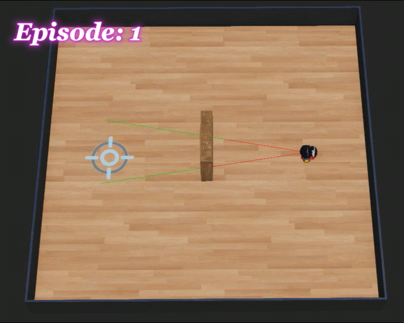
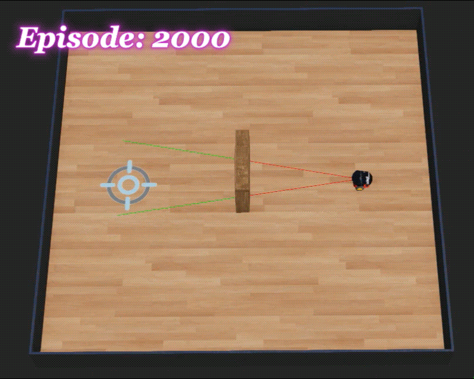
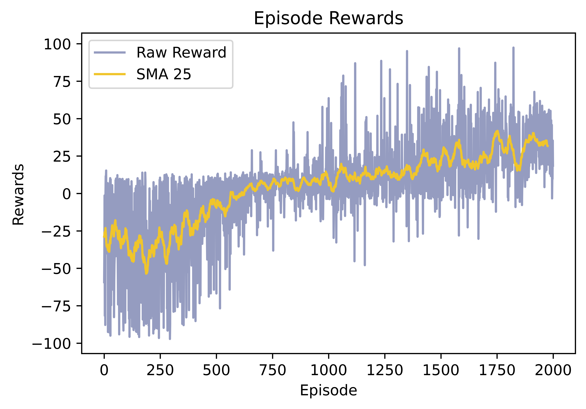

## Description
This repository contains a Python implementation of the REINFORCE algorithm (with action-independent baseline) from the deep reinforcement learning family for path planning and obstacle avoidance of a two-wheeled robot in the Webots simulator. The objective is to navigate autonomously through the environment from point A to point B with the [Pioneer 3-DX](https://www.cyberbotics.com/doc/guide/pioneer-3dx?version=cyberbotics:R2019a-rev1) robot without any collisions.

If you're unfamiliar with Webots, I strongly suggest beginning by exploring this [link](https://github.com/MehdiShahbazi/Webots-simple-move) to initiate your journey with the platform.

## Introduction
REINFORCE is a policy gradient algorithm to discover a good policy that maximizes cumulative discounted rewards. In simple terms, the core idea of the algorithm is to learn the good policy by increasing the likelihood of selecting actions with positive returns while decreasing the probability of choosing actions with negative returns using neural network function approximation. The major pros and cons of the algorithm are as follows [[1]](#1):

###### Advantages:
1. 	**Gradient Optimization:** REINFORCE uses gradient ascent optimization which facilitates the learning of policies by modifying the parameters toward higher expected rewards. Hence, it is useful in policy optimization for navigation tasks, allowing robot to learn from its own mistakes.

###### Disadvantages:
1. 	**High Variance in Gradient Estimation:** One significant drawback of REINFORCE is its susceptibility to high variance in gradient estimation. This can lead to slow convergence and instability during training. Techniques like baseline subtraction are often employed to mitigate this issue.

2. 	**Same Behavior for All Actions:** When all returns are positive, both favorable and unfavorable actions will be strengthened. Conversely, if all returns are negative, both positive and negative actions will be weakened.

3. 	**Sample Inefficiency:** REINFORCE can be sample inefficient, requiring a large number of environment interactions to achieve satisfactory performance.

## Requirements
The code is written in Python 3.8.10 and has been tested on Windows 10 without any issues. It utilizes the following libraries:
<pre>
numpy==1.22.0
matplotlib==3.5.1
torch==2.0.1+cu118
</pre>

The simulation has been confirmed as compatible with Webots version: R2023b.

## Usage
For simulation, you need to install [Webots](https://cyberbotics.com) on your system. After installing Webots:

1. Clone the repository.
2. Navigate to the following directory: `./worlds` and open `./worlds/my_world.wbt`
3. Run the simulation and enjoy.
   

The network weights have been pre-saved in the `./controllers/REINFORCE/results/final_weights.pt` directory. Therefore, there's no requirement to start training from scratch for testing the code.

## Showcase
You can view the training procedure through the following GIFs, demonstrating the learned navigation across episodes.

  
  
  

  
  

#### Results
The outcome of the training over 2000 episodes, including the raw reward obtained and the Simple Moving Average of 25 (SMA 25) rewards are as follows:

  

## Persian Tutorial Video
You can access the video tutorial (in persian) explaining the implementation of deep reinforcement learning, particularly the REINFORCE algorithm in Webots from [here](https://youtu.be/REok-WlHql8).

I sincerely hope that this tutorial proves helpful to those of you who are in the process of learning. If you find this repository helpful in your learning journey, consider giving it a star.

## References

-  [Graesser, Laura, and Wah Loon Keng. Foundations of deep reinforcement learning. Addison-Wesley Professional, 2019.](https://scholar.google.com/scholar?hl=en&as_sdt=0%2C5&q=Foundations+of+Deep+Reinforcement+Learning+-+Laura+Graesser+and+Wah+Loon+Keng&btnG=)
